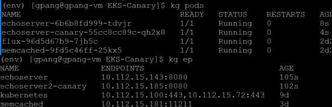
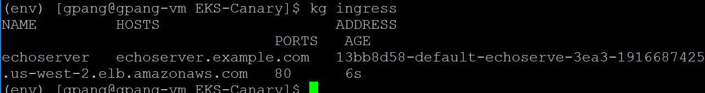

# EKS Canary

This repo contains sample for creating a canary without the need of a service mesh. We will leverage AWS Application load balancer + ALB ingress controller to split traffic into multiple Youservices.

## Prerequisite

Please install (ALB ingress controller)<https://kubernetes-sigs.github.io/aws-alb-ingress-controller/guide/walkthrough/echoserver/> if that isn't already part of your cluster.

## How to use

We will identify echoserver as our production deployment.
[Prod](./echoserver.yaml)

And canary as our canary environment.
[Canary](./echoserver-canary.yaml)

Apply them to your cluster.

```bash
kubectl apply -f ./echoserver.yaml
kubectl apply -f ./echoserver-canary.yaml
```

Check that they are working by checking pods are in Running state and all services have endpoints

```bash
kubectl get pods
kubectl get endpoints
```



Now deploy the ingress

```bash
kubectl apply -f ./ingress.yaml
kubectl get ingress
```



With this now you have an ALB pointing to both production + canary with traffic splitted 95 to 5 respectively. During deployment stage, when an application is ready for canary testing, the application would first be deployed onto the canary deployment (echoserver-canary) by changing the deployment yaml file’s container image to the prod candidate and applying the updated deployment to your EKS cluster. You would monitor the canary pod’s log and metrics and let it bake for the appropriate amount of time. Then you would deploy to prod by making the same change to the prod deployment yaml and applying the change to your EKS cluster.

After deploying to prod, some may take different approach in clean up. I run the canary as part of my production even after the deployment. Since it runs the same code as production, it will serves as an additional node. Some may turn off the canary, you can do this by changing the ingress action and setting prod service to 100 weight and canary weight to 0. This will require changing the ingress after every deployment however this is a cleaner approach from an operational perspective since only your prod deployment is serving production traffic.
